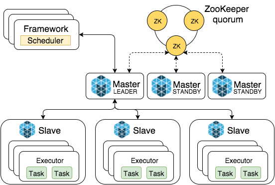

<h2>一、DO/OS和mesosphere</h2>
<h3>1.mesosphere和DCOS的卖相概览</h3>
    
    
    
    
    
    

<h3>2.DCOS概念和生态还不错</h3>
    
    
    
    
    
    
    

<h3>3.mesos和yarn的对比</h3>
    
<h3>4.mesos提高资源利用率</h3>
    

<h3>5.mesos的生态系统</h3>
    

<h3>6.使用mesos的公司</h3>
    

<h3>7.DCOS概念及架构</h3>
    
    
    
    
    
    
    

<h3>8.DCOS概念及架构</h3>
    

<h3>9.二级资源调度</h3>
    
    
    
    

<h2>二、我们的使用情况</h2>
<h4>1.mesos情况</h4>
    
    
    
    
    
<h4>2.marathon情况</h4>
    
    
    
    
    
    

