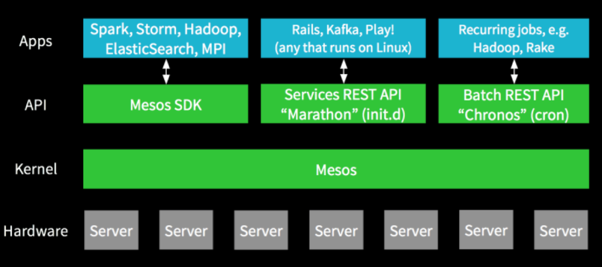

<h3>1.mesosphere和DCOS的卖相概览</h3>

<h3>2.DCOS概念和生态还不错</h3>

<h3>mesos和yarn的对比</h3>

<h3>mesos提高资源利用率</h3>

<h3>mesos的生态系统</h3>

<h3>使用mesos的公司</h3>

<h3>2.DCOS概念及架构</h3>

<h3>2.DCOS概念及架构</h3>

<h3>2.我们的使用情况</h3>
<h4>2.mesos情况</h4>

<h4>2.mesos情况</h4>

<h4>2.Nginx情况</h4>

